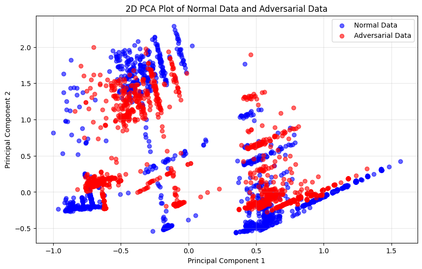

# Prototype - alpha

| Properties           | Data                 |
| -------------------- | -------------------- |
| *Labels*             | `['BENIGN', 'DDoS']` |
| *Normalization*      | `Min-Max`            |
| *Sample Size*        | `4000`               |
| *Adversarial Attack* | `FGSM`               |
| *Explanations*       | `SHAP`               |

The data distribution of the *CICIDS2017* dataset is not balanced. We have a lot of attack classes that are described by only a few samples:


In our Prototype we decided to focus just on a single attack class (**DDoS**). Because this is our first Prototype, we want to find out the best possible detection setup and for this we limit the scope to only one attack class. So we operate in a **binary-classification** setup which is very well suited at the beginning. We choose the **DDoS** class because it has a lot of samples in it. 

To make this Prototype fast executable we will just work with `4000` samples. We also utilize only a single adversarial attack (**FGSM**) to generate and learn from its explanations. We decide on *FGSM* attacks because they can be very fast generated, and they change a lot of values which results in a high accuracy drop of the IDS. Therefore, there are easy to detect, but powerful. To generate explanations of the decision model, we use **SHAP**.

The goal of this Prototype *alpha* is to identify a working prediction structure, ranging from an accuracy IDS to an accuracy adversarial attack detector. We will later build on the identified structure to detect more attacks classes and more adversarial attacks.

---
# Intrusion Detection System

## Dataset

We create a balanced dataset consists only of *BENIGN* and *DDoS* samples.  We randomly select `2000` samples of each class.

| BENIGN | DDoS  |      |
| ------ | ----- | ---- |
| False  | True  | 2000 |
| True   | False | 2000 |

## IDS Model

We split the dataset into *train* and *test* data with a `0.2` split ratio:
```python
X_train, X_test, y_train, y_test = train_test_split(feature_df, label_df, test_size=0.2, random_state=42)
```
We split the *train* data once again in *train* and *validation* data. This data is used to train our IDS. On the *test* data we achieve an accuracy of over `98%` in detecting *BENGIN* and *ATTACK* network traffic.


--- 
# Detector
## FGSM - Adversarial Attacks

We focus only on the simple **FGSM** attack. We created `3.200` adversarial samples on the *train* set. With the adversarial samples we decrease the prediction performance of our IDS to under **`19%`**


The different data distribution from normal samples and *FGSM* adversarial samples are shown here: 



## Explanations

We generate `3.200` explanations from normal samples (*X_test*) and `3.200` explanations from adversarial modified samples (*X_adv_fgsm*).

As we can see, the explanations from both classes differ more than the raw data.


Comparing **normal explanations** (left) with **adversarial explanations** (right) on ***BENIGN*** samples, we observe differences in both the key features influencing the prediction and the distribution of SHAP values - even for the same feature.


## Detector Model

We build a dataset for our detector model by adding labels `[1, 0]` to the normal explanations and `[0, 1]` to adversarial explanations. With this dataset, we train our detector. The goal of the trained detector is to distinguish between adversarial modified data (from the *FGSM* attack) and normal data.

The detector model is trained with a train-test split ratio of `0.1` on the dataset and a train-validation split ratio of `0.2` on the *train* set. The model achieves an accuracy of `99.8%` on the *test* set.


---
# Evaluation

For the evaluation of our detector, we sample completely new data from the complete dataset. We use the **same normalizer** to ensure comparability. With the **same adversarial model** we generate `1.000` *FGSM* attacks. We also use the **same explainer** to generate our explanations. With these explanations we evaluate our detector if it can decide between normal samples and adversarial samples generated by the *FGSM* attack.


**Our Prototype *alpha* shows a great performance in detecting adversarial modified samples from the *FGSM* attack!**