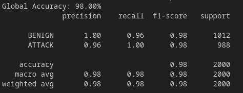
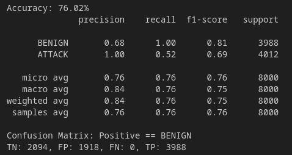
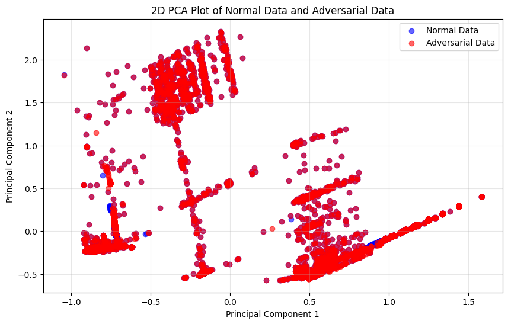
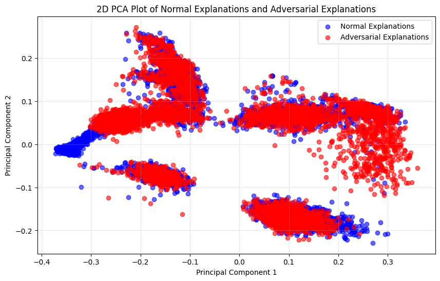
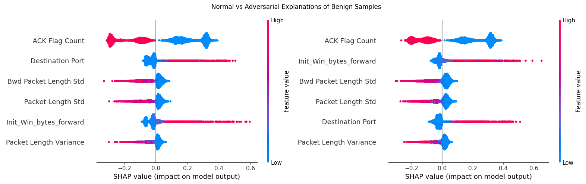
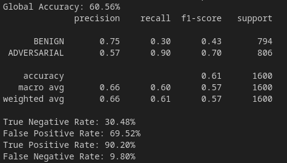

# Prototype - beta

| Properties           | Data                 |
| -------------------- | -------------------- |
| *Labels*             | `['BENIGN', 'DDoS']` |
| *Normalization*      | `Min-Max`            |
| *Sample Size*        | `10.000`               |
| *Adversarial Attack* | `C&W`               |
| *Explanations*       | `SHAP`               |

We use the same data distribution as in our [Prototype *alpha*](Prototype%20-%20alpha.md), including the focus on the single attack class **DDoS** and the use of **binary-classification**. 

In this Prototype we want to evaluate how our previously created setup will work on a different adversarial attack the **C&W** attack. "This attack is among the most effective and should be used among the primary attacks to evaluate potential defenses" ([ART Toolbox](https://adversarial-robustness-toolbox.readthedocs.io/en/latest/modules/attacks/evasion.html)). We work with `10.000` samples to generate a meaningful detector.

---
# Intrusion Detection System

## Dataset

We create a balanced dataset consists only of *BENIGN* and *DDoS* samples.  We randomly select `5000` samples of each class.

| BENIGN | DDoS  |      |
| ------ | ----- | ---- |
| False  | True  | 5000 |
| True   | False | 5000 |

## IDS Model

We split the dataset into *train* and *test* data with a `0.2` split ratio. We split the *train* data once again in *train* and *validation* data. This data is used to train our IDS, the *test* data is used to evaluate the model. We recognize that in each train and evaluation run the accuracy of the IDS change. This is because Neural networks initialize their weights randomly before training. We include a fixed random seed before the model creation to ensure reproducibility.

At the end we receive an accuracy of `98%` in detecting *BENGIN* and *ATTACK* network traffic. This result is very similar to our Prototype *alpha* as only the number of samples differs. 

--- 
# Detector
## C&W - Adversarial Attacks

We focus on the powerful and hard-to-detect **C&W** attack. His generation with the *ART Toolbox* takes a lot of time, so we parallelize this process. Through parallelization, we decreased the generation time from `3h` to only around `16min`. We created `8.000` adversarial samples on the *train* set. This time, we generate a *targeted attack*. We target the label `[1, 0]` as this label represents the *BENIGN* class that is the desired classification output of attackers so that their attacks are not detected by the IDS.

With the adversarial samples we decrease the prediction performance of our IDS to under **`75%`**

The different data distribution from normal samples and *FGSM* adversarial samples are shown in the following image. As we can see, the changes in the raw data are very minimal.

## Explanations

We generate `8.000` explanations from normal samples (*X_test*) and `8.000` explanations from adversarial modified samples (*X_adv*).

As we can see, the explanations from both classes differ more than the raw data but this time, the **differences are not so big**.

Comparing **normal explanations** (left) with **adversarial explanations** (right) on ***BENIGN*** samples, we also observe that the changes in the explanations are very small between both classes.

## Detector Model

We build a dataset for our detector model by adding labels `[1, 0]` to the normal explanations and `[0, 1]` to adversarial explanations. With this dataset, we train our detector. The goal of the trained detector is to distinguish between adversarial modified data (from the *C&W* attack) and normal data. We also make sure that the detector accuracy do not vary between different runs and include a fixed random state.

The detector model is trained with a train-test split ratio of `0.1` on the dataset and a train-validation split ratio of `0.2` on the *train* set. The model achieves a bad accuracy of only `60.56%` on the *test* set. **Our detector cannot detect C&W attacks!**

## Compare with Raw-Data Detector

We build a detector that makes decision based on given raw data. This detector acts as a comparator to our proposed solution. We build the training dataset of this detector by adding labels `[1, 0]` to the normal raw data and `[0, 1]` to adversarial raw data. We compare its accuracy with our proposed detector to see the relevance. The comparison is displayed in the following figure:

---
# Improvements

As we can see, our created setup is not applicable for the strong **C&W** attack. We need to adjust our setup. Here are some ideas:

- Train only *BENIGN* explanations -> Learn False-Positive