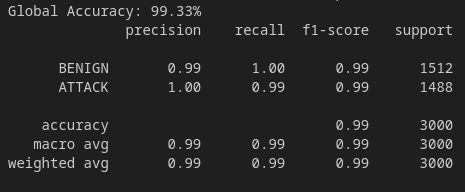
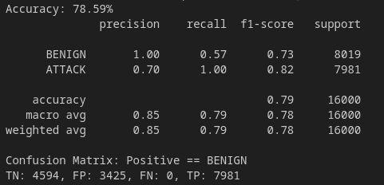
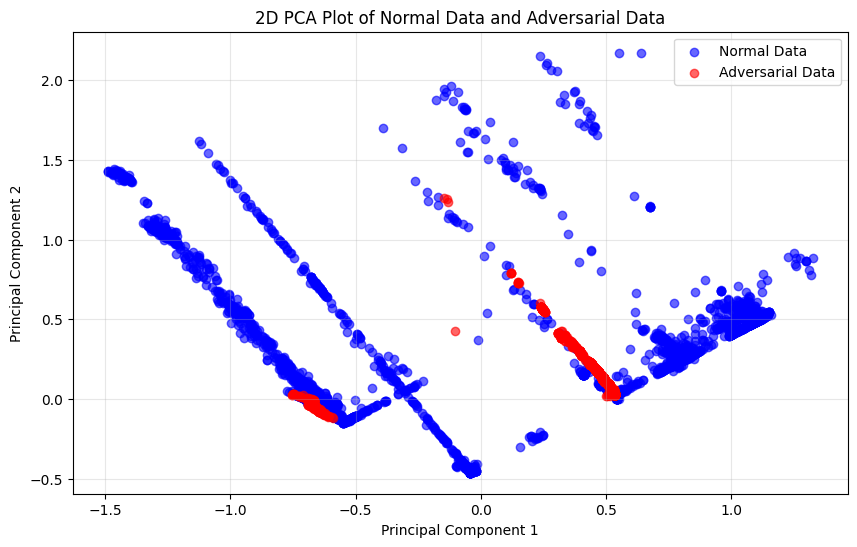
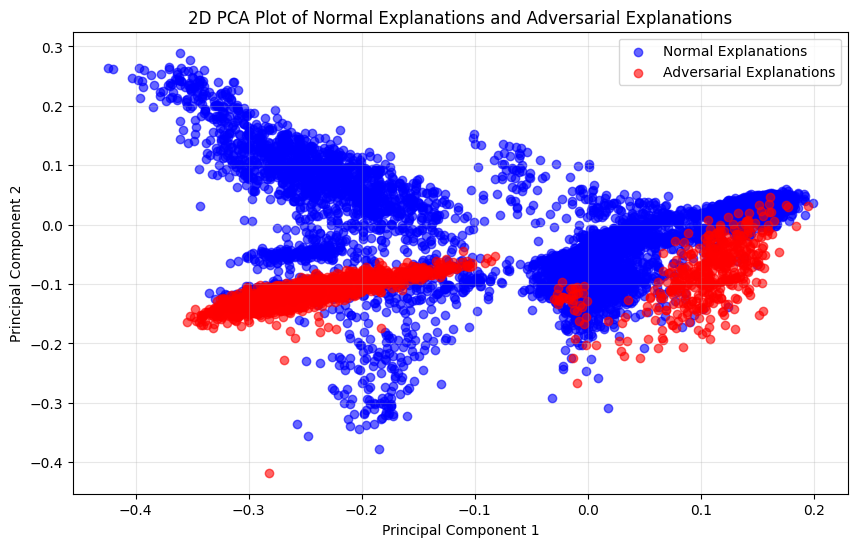
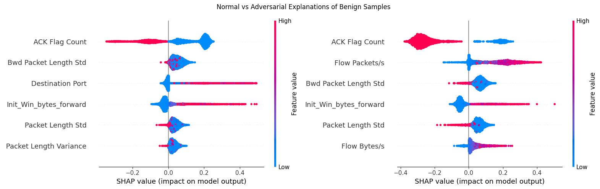
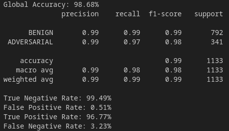
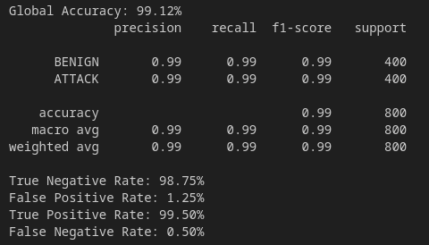

# Prototype - beta

| Properties           | Data                 |
| -------------------- | -------------------- |
| *Labels*             | `['BENIGN', 'DDoS']` |
| *Normalization*      | `Min-Max`            |
| *Sample Size*        | `20.000`               |
| *Adversarial Attack* | `C&W`               |
| *Explanations*       | `SHAP`               |
| *Detector*           | `Detect misclassified Samples`|

Because our [Prototype *beta*](Prototype%20-%20beta.md) failed, we try out a different idea to detect the most effective *C&W* adversarial attack. The steps *Dataset*, *IDS Model* and *Adversarial Attacks* are the same as for the *delta* Prototype.

## Idea:

We saw that the *C&W* attack results in a decreased IDS accuracy of `76%`

Unlike the previous prototypes, we do not look at all explanations, but focus only on those that belong to **samples that have been misclassified due to the adversarial attack**. We ignore the cases in which adversarial attacks do not have any influence and do not change the IDS prediction. Because we operate a target attack on *BENIGN* samples to obfuscate our attacks, we have no *BENIGN* samples that are misclassified as an *ATTACK* due to adversarial perturbation. We focus solely on misclassified *BENIGN* samples because if an IDS classified *BENIGN* traffic as malicious due to adversarial perturbation, no security problem will arise and therefore no countermeasure has to be implemented. **The task of our generated detector is to decide whether an explanation of a 'BENIGN' classified samples is really 'BENIGN' or misclassified due to an adversarial attack.**

---
# Intrusion Detection System

## Dataset

We create a balanced dataset consists only of *BENIGN* and *DDoS* samples.  We randomly select `10000` samples of each class. To create our *test* and *train* set, we use this time a *train-test-split* of `0.1`.

| BENIGN | DDoS  |      |
| ------ | ----- | ---- |
| False  | True  | 10000 |
| True   | False | 10000 |

## IDS Model

--- 
# Detector
## C&W - Adversarial Attacks

With the generated *C&W* adversarial attacks, we successfully reduce the IDS prediction accuracy from `99%` to `~78%`. Because we perform a target attack, only *false-positive* samples are generated.

## Explanations

We generate `16.000` explanations from normal samples (*X_test*) and `16.000` explanations from adversarial modified samples (*X_adv*).

## Data Selection

We filter out indices of samples that are classified as *BENIGN* from the IDS. In order to work on indices and keep track on the correct labels throughout our whole process, we use the indices from the original dataset and make sure to always move them along.

We divide the *BENIGN* samples into two categories:
- *ATTACK* samples that are misclassified as *BENIGN* from the IDS: `7962`
- *BENIGN* samples that are correctly classified as *BENIGN* from the IDS: `3360`

## Data Distribution

We compare the data distribution from raw data and explanations to display in which case an easier separation of *correctly classified samples* and *misclassified samples* can be done.

**Raw Data Separation of *correctly classified samples* and *misclassified samples***.

 

**Explanation Separation of *correctly classified samples* and *misclassified samples***.

We can see that it is more likely to detect *misclassified samples* from the explanations rather than from the raw data.

When comparing the explanations from *correctly classified samples* (left) with *misclassified samples* (right), we see a lot of differences.

## Detector Model

**We want to build a detector that detects adversarial attacks that are so powerful that the prediction output of the IDS is changed.** For this we have to create own dataset to train the detector. We add labels `[1, 0]` to the explanations from the *correct classified samples* and `[0, 1]` to explanations from *misclassified samples*. 

With this dataset, we train our detector. The goal of the trained detector is to distinguish between samples that wrongly tricks the IDS into classifying them as *BENIGN* (from the *C&W* attack) and normal *BENIGN* samples. We also make sure that the detector accuracy do not vary between different runs and include a fixed random state.

The detector model is trained with a train-test split ratio of `0.1` on the dataset and a train-validation split ratio of `0.2` on the *train* set. The model achieves a very good accuracy of `98.68%` on the *test* set.

---
# Evaluation

Because we have a two-stage process, we have to manually calculate the accuracy. To do so, we generate new and completely unseen `400` samples of each class.

### Calculate True-Positive
Our detector detects true positive samples therefore we have to check its predictions. We check if the predicted *BENIGN* samples are really *BENIGN*. Because we work with indices, we have to check whether the indices are contained in both lists.

### Calculate False-Positive
For false positive, we check what samples our detector classifies as *BENIGN* that are originally *ATTACK*.

### Calculate True-Negative
To calculate true negative, we have to combine two observations. `TN1` is calculated by counting the samples that are classified as *ATTACK* from the IDS and are also originally *ATTACK*. `TN2` is calculated by counting the samples that the detector classifies as *ATTACK* that are originally *ATTACK*. `TN = TN1 + TN2`

### Calculate False-Negative
For false negative, we also have to combine two observations. `FP1` is calculated by counting all samples that the IDS classifies as *ATTACK* that are in really *BENIGN* and `FP2` is calculated by counting all samples that the detector classifies as *ATTACK* that are in really *BENIGN*. `FP = FP1 + FP2`

## Results

## TODO:
- Evaluate Performance on normal Data