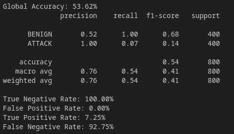

# Prototype - epsilon

| Properties           | Data                 |
| -------------------- | -------------------- |
| *Labels*             | `['BENIGN', 'DDoS']` |
| *Normalization*      | `Min-Max`            |
| *Sample Size*        | `10.000`               |
| *Adversarial Attack* | `FGSM`               |
| *Explanations*       | `SHAP`               |
| *Detector*           | `Detect misclassified Samples`|

We want to evaluate if our detector created in [Prototype *delta*](Prototype%20-%20delta.md) will still work for a different adversarial attack. For this purpose we create Prototype *epsilon* were we evaluate the *FGSM* adversarial attack on our detector model. Our overall goal is to develop a universal detector that is suitable for every adversarial attack. It is therefore important to check whether *FGSM* attacks can be detected, which would be a first indication that all other attacks could also be detected.

---
# IDS & Detector

We perform the exact same steps as described in [Prototype *delta*](Prototype%20-%20delta.md) to create an IDS and detector. We just use only `5000` samples from each class and create *FGSM* adversal samples and explanations.

# Result

## Diagnostic

As we can see, our generated two-stage approach can not be used with the *FGSM* attack. We reach a very bad accuracy of around `50%`. When you look further into how the accuracy is composed, we can see that our detector classifies nearly every sample as *NEGATIVE* which means *MISCLASSIFIED DUE TO ATTACK*. We train our detector with *BENIGN* explanations from normal data and *MISCLASSIFIED DUE TO ATTACK* samples from adversarial data. The result indicates that all samples from the *FGSM* attack have more similarities with the explanations from the adversarial attack even though the predicted label is different. *BENIGN* samples generated by the adversarial attack that are still *BENIGN* are classified as *MISCLASSIFIED DUE TO ATTACK* because of their similar explanation structure.

*FGSM* is an adversarial attack that changes the values more than the *C&W* attack and can misclassify almost every *ATTACK* samples (`53%` accuracy on *FGSM* attacks vs `78%` accuracy on *C&W* attacks). **My hypothesis is that for adversarial attacks that change the values heavily, adversarial explanations are more close together than the different explanations for *BENIGN* and *ADVERSARIAL***. Our detector that decides between, in general, good (normal data) good (*BENIGN*) and bad (adversarial data) bad (*MISCLASSIFIED DUE TO ATTACK*) data, will classify adversarial data always to the later class because it is trained on adversarial data.

# Improvement Ideas:
- Train Detector on Normal and Adversarial Data
    - **Result:** Detection is possible with nearly `96%` accuracy
    - **Limitation:** We have to train the Detector with each Adversarial Attack (maybe even with every single version of an adversarial attack)
- Combine [Prototype *alpha*](Prototype%20-%20alpha.md) (detect adversarial attacks) and [Prototype *delta*](Prototype%20-%20delta.md) (detect misclassified *BENIGN* samples). So we use the first model to find adversarial attacks and the second one for more fine attacks to detect samples that are misclassified by an attack.
    - **Result:** Should work
    - **Limitation:** Bad comparability due to different evaluation techniques (how to evaluate the performance of such models?)
- Use **Autoencoder** to perform one-class classification and just learn how correct *BENIGN* samples look like. Therefore, we do not need to learn all adversarial attacks.