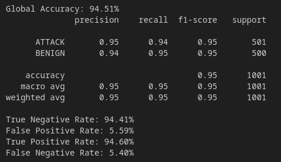
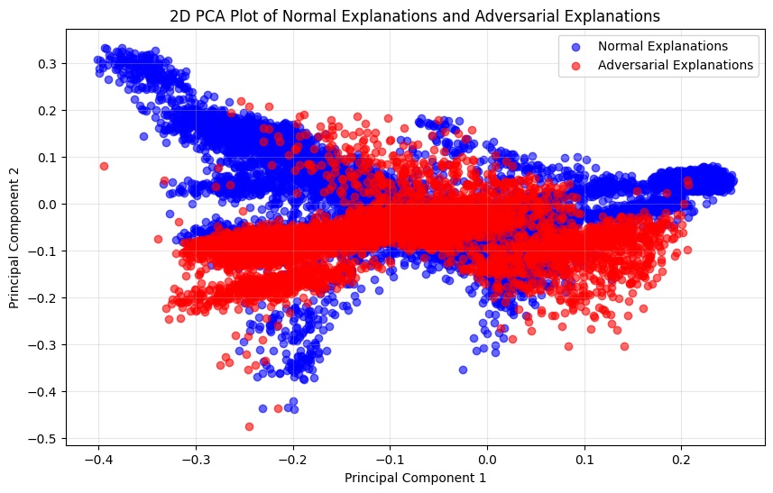
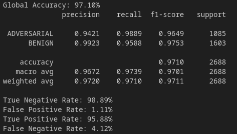
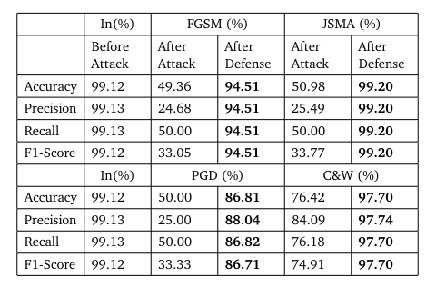

# Prototype - iota

| Properties           | Data                 |
| -------------------- | -------------------- |
| *Labels*             | `['BENIGN', 'DDoS']` |
| *Normalization*      | `Min-Max`            |
| *Sample Size*        | `40.000`               |
| *Adversarial Attack* | `FGSM & C&W & PGD & JSMA`               |
| *Explanations*       | `SHAP`               |
| *Detector*           | `Detect misclassified Samples of all White-Box Attacks`|

In this Prototype we change our two detection classes due to the failure of [Prototype *epsilon*](Prototype%20-%20epsilon.md) in detecting *FGSM* attacks. Our detector now decides between **CORRECT BENIGN samples adversarial or not vs MISCLASSIFIED AS BENIGN samples due to adversarial attacks**. In [Prototype *epsilon*](Prototype%20-%20epsilon.md) we found out that the explanations of *correct BENIGN* and *misclassified BENIGN* of the *FGSM* adversarial attack are more similar together than the explanations of *correct BENIGN* from the *FGSM* attack and *correct BENIGN* from the normal traffic. Therefore, we made the change to find out the original label the samples have even after an adversarial attack. If a *BENIGN* sample is perturbed and still classified as *BENIGN* from the IDS, the attack is not strong and of no danger for our system. So our new class *CORRECT BENIGN* holds all samples that are not *ATTACK* but are misclassified as *BENIGN* by the IDS due to any adversarial attack. **⇾ We find out all samples that causes a misclassification!**

We start by evaluating our new Prototype with the *FGSM* attack that was previously not successful classified.

---
# FGSM Detector

We generate `6.400` *FGSM* attacks. From these attack the IDS classified `3.159` samples correctly as *BENIGN*. `3.237` samples are misclassified as *BENIGN* despite being an *ATTACK*. Our detector is trained on the positive class (explanations from normal *BENIGN* samples and explanations from correctly classified *BENIGN* adversarial samples) and on the negative class (explanations from misclassified *BENIGN* adversarial samples). 

As we can see in the following plot, a separation of correctly classified *BENIGN* samples and misclassified *BENIGN* samples can be visually be done.

## Result

We see that detecting the samples that the IDS misclassify as *BENIGN* can be done with a `94.51`% accuracy. 

## Discussion

This result is good but also not very great. In [Prototype *epsilon*](Prototype%20-%20epsilon.md) we experienced that the explanations of *BENIGN* and *ATTACK* samples generated by the *FGSM* adversarial attack differs. So making a decision whether these explanations belong to the correct *BENIGN* or misclassified *BENIGN* class is very hard to make. This explains our not great detector results. In [Prototype *alpha*](Prototype%20-%20alpha.md) we have showed that the *FGSM* attack can be detected with an accuracy of `99`%. This also underlines the difficulties of the current detector because not only *ATTACK* samples are changed a lot, also *BENIGN* samples are changed a lot which allows an overall detection of the attack but not more fine granulate separation on which original label has been changed.

# White-Box Detector (FGSM & C&W & PGD & JSMA)

We now extend our detector by adding other well-known White-Box adversarial attack in the form of *Carlini & Wagner (C&W)*, *Projected Gradient Descent (PGD)* and *Jacobian Saliency Map Attack (JSMA)*. 

We sample out `20.000` *BENIGN* samples and `20.000` *ATTACK* (DDoS) samples. With this dataset we train our IDS that reaches an accuracy of over `99`%. We split this data into 5 evenly sized classes: *normal*, *fgsm*, *cw*, *pgd* and *jsma*. On these classes we generate the related adversarial attack and their explanations. The accuracy of the IDS prediction after the adversarial attack is `49,36`%, `76,42`%, `50`% and `50,98`% for the attacks *FGSM*, *C&W*, *PGD* and *JSMA* respectively.

## Explanation Distribution

## Detector Result 

As we can see, our detector have a very high accuracy of `97.10%` in detecting *correct BENIGN* and *misclassified BENIGN*. With this accurate detector, we will calculate the overall accuracy of classifying *BENIGN* and *ATTACK* samples with or two-stage approach.

## Evaluation

Because we operate with two stages (IDS and detector), we have to combine both performance metrics into a single one.

### TP, FP, TN, FN Calculation

In the IDS stage, we classify samples to *BENIGN* and *ATTACK*. In this stage we can calculate *True Negative (TN)* and *False Negative (FN)* samples. We are not yet able to make statements about *BENIGN* (positive) predicted samples as these are forwarded to the detector. 
- ***TN_IDS*** : IDS classifies *ATTACK* samples as *ATTACK*
- ***FN_IDS*** : IDS classifies *BENIGN* samples as *ATTACK*

In the detector stage, we can make assumptions about the positive and negative case because here, we decide whether a sample is *correctly BENIGN* (positive) or *misclassified BENIGN* (negative). In addition to *TN* and *FN*, we calculate *True Positive (TP)* and *False Positive (FP)* samples.
- ***TP*** : Detector classifies *BENIGN* samples as correct *BENIGN*
- ***FP*** : Detector classifies *ATTACK* samples as correct *BENIGN*
- ***TN_DET*** : Detector classifies *ATTACK* samples as misclassified due to *ATTACK*
- ***FN_DET*** : Detector classifies *BENIGN* samples as misclassified due to *ATTACK*

We add the samples of *TN* and *FN* from both stages to receive the global amount.
- ***TN*** : *TN_IDS* + *TN_DET*
- ***FN*** : *FN_IDS* + *FN_DET*

With these calculated *TP*, *FP*, *TN*, *FN* values, we generate a classification report to extract the accuracy, precision, recall and f1-score. These metrics are used to compare the effectiveness of our proposed model towards the four white-box adversarial attacks.

### Classification Results

As we can see, our two-stage approach increases the performance of the classification enormously compared with the accuracy after the attack. But we not quite reach the accuracy the IDS have before the attack occurs.

# Diagnosis

We observe strong results, particularly for the *JSMA* and *C&W* attacks. However, for the *PGD* attack, the performance is relatively moderate.

## Hypothesis

**We believe this is due to the nature of the *PGD* attack, which, similar to *FGSM*, significantly alters all input samples. As a result, distinguishing correctly classified BENIGN samples from misclassified BENIGN samples becomes challenging.**

To support this hypothesis, we use our [Prototype *alpha*](Prototype%20-%20alpha.md) to evaluate the detection rate of *PGD* attacks. Our prototype achieves a detection accuracy of `99.55`%, highlighting a substantial difference between adversarial and normal samples. We observe a similar pattern for the *FGSM* attack.

Although these attacks are easily detected, the challenge lies in correctly classifying BENIGN samples—whether they remain correctly classified or become misclassified. This difficulty aligns with our hypothesis.

## Improvements

Since we can detect adversarial samples with high accuracy, the safest approach is to eliminate all detected attacks rather than selectively removing only those that are misclassified as *BENIGN*. To achieve this, we need to develop a prototype capable of handling both scenarios, ensuring robustness against all adversarial attacks and maximizing security.