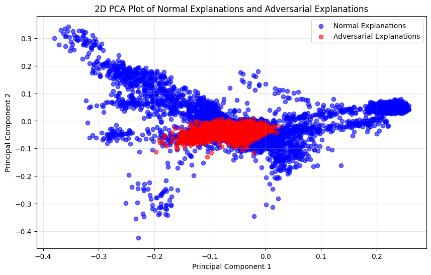

# Prototype - iota

| Properties           | Data                 |
| -------------------- | -------------------- |
| *Labels*             | `['BENIGN', 'DDoS']` |
| *Normalization*      | `Min-Max`            |
| *Sample Size*        | `20.000`               |
| *Adversarial Attack* | `FGSM & C&W & PGD & JSMA`               |
| *Explanations*       | `SHAP`               |
| *Detector*           | `Detect misclassified Samples of all White-Box Attacks`|

In this Prototype we change our two detection classes due to the failure of [Prototype *epsilon*](Prototype%20-%20epsilon.md) in detecting *FGSM* attacks. Our detector now decides between **CORRECT BENIGN samples adversarial or not vs MISCLASSIFIED AS BENIGN samples due to adversarial attacks**. In [Prototype *epsilon*](Prototype%20-%20epsilon.md) we found out that the explanations of *correct BENIGN* and *misclassified BENIGN* of the *FGSM* adversarial attack are more similar together than the explanations of *correct BENIGN* from the *FGSM* attack and *correct BENIGN* from the normal traffic. Therefore, we made the change to find out the original label the samples have even after an adversarial attack. If a *BENIGN* sample is perturbed and still classified as *BENIGN* from the IDS, the attack is not strong and of no danger for our system. So our new class *CORRECT BENIGN* holds all samples that are not *ATTACK* but are misclassified as *BENIGN* by the IDS due to any adversarial attack. **-> We find out all samples that causes a misclassification!**

We start by evaluating our new Prototype with the *FGSM* attack that was previously not successful classified.

---
# FGSM Detector

We generate `6.400` *FGSM* attacks. From these attack the IDS classified `3.159` samples correctly as *BENIGN*. `3.237` samples are misclassified as *BENIGN* despite being an *ATTACK*. Our detector is trained on the positive class (explanations from normal *BENIGN* samples and explanations from correctly classified *BENIGN* adversarial samples) and on the negative class (explanations from misclassified *BENIGN* adversarial samples). 

As we can see in the following plot, a separation of correctly classified *BENIGN* samples and misclassified *BENIGN* samples can be visually be done.

## Result

We see that detecting the samples that the IDS misclassify as *BENIGN* can be done with a `94.51`% accuracy. 

## Discussion

This result is good but also not very great. In [Prototype *epsilon*](Prototype%20-%20epsilon.md) we experienced that the explanations of *BENIGN* and *ATTACK* samples generated by the *FGSM* adversarial attack differs. So making a decision whether these explanations belong to the correct *BENIGN* or misclassified *BENIGN* class is very hard to make. This explains our not great detector results. In [Prototype *alpha*](Prototype%20-%20alpha.md) we have showed that the *FGSM* attack can be detected with an accuracy of `99`%. This also underlines the difficulties of the current detector because not only *ATTACK* samples are changed a lot, also *BENIGN* samples are changed a lot which allows an overall detection of the attack but not more fine granulate separation on which original label has been changed.

# White-Box Detector (FGSM & C&W & PGD & JSMA)

We now extend our detector by adding other well-known White-Box adversarial attack in the form of *Carlini & Wagner (C&W)*, *Projected Gradient Descent (PGD)* and *Jacobian Saliency Map Attack (JSMA)*. 

We sample out `20.000` *BENIGN* samples and `20.000` *ATTACK* (DDoS) samples. With this dataset we train our IDS that reaches an accuracy of over `99`%. We split this data into 5 evenly sized classes: *normal*, *fgsm*, *cw*, *pgd* and *jsma*. On this classes we generate the related adversarial attack and their explanations. The accuracy of the IDS prediction after the adversarial attack is `49,36`%, `76,42`%, `50`% and `50,98`% for the attacks *FGSM*, *C&W*, *PGD* and *JSMA* respectivly.

## Explanation Distribution

## Detector Result 

# Discussion

We can see some good results especially for *JSMA* and *C&W* attacks. For the *PGD* attack we reach a relatively bad result. My hypothesis for this is: **Similar to the *FGSM* attack, the *PGD* changes all samples a lot, therefore dividing between correctly *BENIGN* and misclassified *BENIGN* samples is very hard.** To test this hypothesis we will look into the explanation distribution of both classes and see how much they change, we also compare these with the explanation distribution of the *FGSM* attack. Additionally, we will check whether the *PGD* attack can easily be detected as an adversarial attack. Based on our received results we can elaborate further.

## Diagnosis

## Improvements
