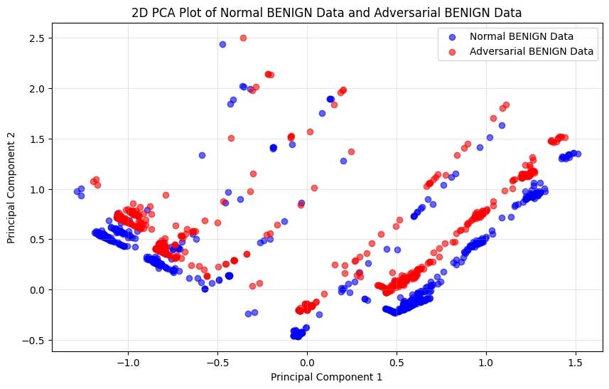
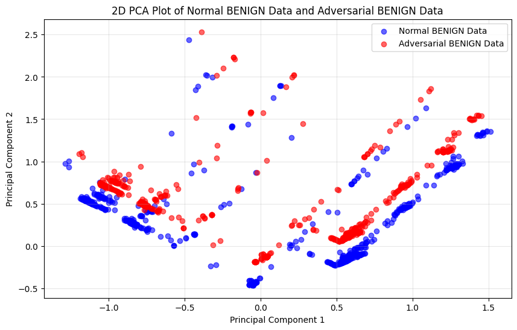
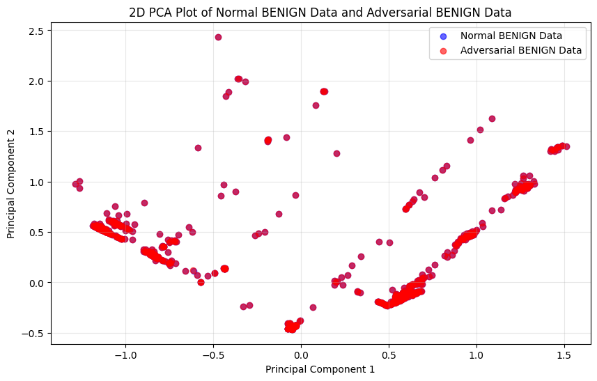
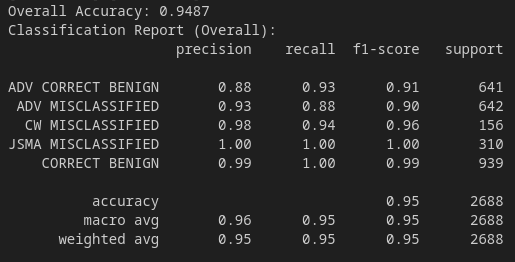

# Prototype: kappa

| Properties      | Data    |
|---------------|-----------|
| *Labels* | `['BENIGN', 'DDoS']` |
| *Normalization* | `Min-Max` |
| *Sample Size* | `40.000`|
| *Adversarial Attack* | `FGSM & C&W & JSMA & PGD` |
| *Explanations* | `SHAP` |
| *Detector* | `Detect Attacks and Misclassified Samples` |

In our [Prototype *iota*](Prototype%20-%20iota.md), we evaluated the prediction accuracy of correctly identifying labels despite the presence of multiple adversarial attacks. We observed strong results for the *C&W* and *JSMA* attacks but more moderate performance for the *FGSM* and *PGD* attacks.

Interestingly, the attacks with moderate classification accuracy (*PGD*, *FGSM*) could be detected with nearly `100%` accuracy using a simple detector ([Prototype *alpha*](Prototype%20-%20alpha.md)).

With this prototype, our goal is to enhance the detector's performance by enabling it to filter out adversarial attacks entirely. For cases where direct detection is not feasible, the model should instead focus on identifying misclassified samples.

---
# Detector Classes

We have to find out what classes our detector needs. We want to make it the most general as possible. For that, we have to look into how the data distribution from all the 4 White-Box attacks looks like. We combine similar data distributions into the same class. 

## BENIGN Class

| **FGSM** | **PGD** |
| ------- | ------- |
|  |  |

| **C&W** | **JSMA** |
| ------- | ------- |
|  |  |

These images display the adjustment of *BENIGN* samples on a targeted adversarial attack on *ATTACK* samples. As we can see, only the attacks *FGSM* and *PGD* changes *BENIGN* samples. The *BENIGN* distribution of *normal*, *C&W* and *JSMA* data is almost identical.

Based on this exploration, we generate two classes for *correct BENIGN* samples.
- *'ADV CORRECT BENIGN'* : explanations from *FGSM* and *PGD* correct *BENIGN* predicted samples
- *'CORRECT BENIGN'* : explanations from *normal*, *C&W* and *JSMA* *BENIGN* samples

## MISCLASSIFIED Class

We define for each of the *JSMA* and *C&W* attack an own misclassification class. Also, we create a single misclassification class for the *FGSM* and *PGD* attacks. Both attacks are combined because they also share a single class in the *BENIGN* case. 

In the end we have the following misclassification classes:
- *'ADV MISCLASSIFIED'* : explanations from *FGSM* and *PGD* misclassified as *BENIGN* samples
- *'CW MISCLASSIFIED'* : explanations from *C&W* misclassified as *BENIGN* samples
- *'JSMA MISCLASSIFIED'* : explanations from *JSMA* misclassified as *BENIGN* samples

---
# Detector

## Building

For our detector, we split our `20.000` samples into *train* and *test* samples with a `0.2` split. We then divide our *train* data evenly into 5 classes (*normal*, *fgsm*, *cw*, *pgd*, *jsma*). Each class contain `6.400` samples. On these samples we generate the respective attacks and their explanations.  

For each attack class we filter out samples that are *correctly BENIGN* and those that are *misclassified as BENIGN*. We generate the detector classes as we discussed earlier ([Detector Classes](#detector-classes)). At the end we receive the following detector classes:

| **Class** | **Samples** |
| ------- | ------- |
| 'ADV CORRECT BENIGN' | `6317` |
| 'ADV MISCLASSIFIED' | `6430` |
| 'CW MISCLASSIFIED' | `1509`|
| 'JSMA MISCLASSIFIED' | `3132` |
| 'CORRECT BENIGN' | `9484` |

## Train - Result

Our detector reaches a good overall accuracy of `94.87%`. Especially the specified classes such as *'CW MISCLASSIFIED'*, *'JSMA MISCLASSIFIED'* and *'CORRECT BENIGN'* do have a very high accuracy. Samples from these classes can be easily classified. Our two classes that consists of *FGSM* and *PGD* samples show not the same level of performance. Between the two classes (*CORRECT BENIGN* and *MISCLASSIFIED*), we have some misclassifications due to the fact that these two attacks also change *BENIGN* samples which made the samples look more similar and which made their separation more difficult (also mentioned in [Prototype *iota*](Prototype%20-%20iota.md)).

---
# Evaluation

## Detection Rate

In addition to classification performance, we want to evaluate how well our detector can detect adversarial attacks in form of *FGSM* and *PGD*. For this purpose we track in which classes the samples of the respective attacks are classified. For our evaluation we craft `1.000` *FGSM* and `1.000` *PGD* attacks with their explanations.

| **Class** | **Classified *FGSM* Samples** | **Classified *PGD* Samples** |
| --- | --- | --- |
| 'ADV CORRECT BENIGN' | `482` | `572` | 
| 'ADV MISCLASSIFIED' | `517` | `427` |
| 'CW MISCLASSIFIED' | `0`| `0` |
| 'JSMA MISCLASSIFIED' | `0` | `0` |
| 'CORRECT BENIGN' | `0` | `1` |
| **Detection Rate** | **`100%`** | **`99.99%`** |

## Classification

