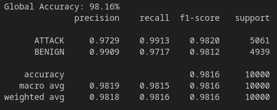

# Prototype: my

| Properties      | Data    |
|---------------|-----------|
| *Labels* | `ALL` |
| *Normalization* | `Min-Max` |
| *Sample Size* | `100.000`|
| *Adversarial Attack* | `FGSM & C&W & JSMA & PGD` |
| *Explanations* | `SHAP` |
| *Detector* | `Detect Attacks and Misclassified Samples` |

We presented our successful detector in [Prototype *kappa*](Prototype%20-%20kappa.md). This prototype was only evaluated on a small part of the *CICIDS2017* dataset. We selected only the labels *BENIGN* and *DDoS*. But, the *CICIDS2017* dataset consists of `17` labels. In this Prototype we address this limitation and evaluate our model with the complete label set.

# Intrusion Detection System

We summarize all malicious labels into the new class *ATTACK* and keep the *BENIGN* class. We sample `50.000` samples from each class. With a `train-test-split` of `0.1` we divide our balanced dataset into train and test data. We increased the `epochs` to `20` and decrease the `batch_size` to `40` of our Neural Network to boost the detection accuracy. At the end, our IDS can detect *BENIGN* and *ATTACK* samples with an accuracy of `98.16%`:

---
# Detector

We train our detector with the same classes we discussed in [Prototype *kappa* - Detector Classes](Prototype%20-%20kappa.md#detector-classes).

| **Class**               | **Samples** | **Explanations**                          |
|-------------------------|-------------|-------------------------------------------|
| 'ADV CORRECT BENIGN'    | `17.765`    | `Correct BENIGN       - FGSM & PGD      ` |
| 'ADV MISCLASSIFIED'     | `17.871`    | `Misclassified BENIGN - FGSM & PGD      ` |
| 'CW MISCLASSIFIED'      | `4.603`     | `Misclassified BENIGN - CW              ` |
| 'JSMA MISCLASSIFIED'    | `8.816`     | `Misclassified BENIGN - JSMA            ` |
| 'CORRECT BENIGN'        | `26.349`    | `Correct BENIGN       - Normal & CS & JSMA` |

We also use a `train-test-split` of `0.1` and change the hyperparameter of our Detector-NN to `epochs=20` and `batch_size=40`. Our detector reaches a good accuracy of `93.36%`.

From this result we can see that our detector can classify '*CW MISCLASSIFIED* ', '*JSMA MISCLASSIFIED* ' and '*CORRECT BENIGN* ' very well, but has problems classifying '*ADV CORRECT BENIGN* *' and '*ADV MISCLASSIFIED* '.

---
# Evaluation

## Classification

We perform the same steps for the classification as in [Prototype *iota* #Evaluation](Prototype%20-%20iota.md#Evaluation). The following shows our new results:

As we can see these result is comparable with our result from [Prototype *kappa*](Prototype%20-%20kappa.md) despite having more attack labels in the original dataset. We also observe very good accuracy for *JSMA* and *C&W* attacks, while the accuracy of predicting the original label during the adversarial obfuscation from *FGSM* and *PGD* attacks is not that good.

## Detection Rate

In addition to classification performance, we want to evaluate how well our detector can detect adversarial attacks in form of *FGSM* and *PGD*. For this purpose we track in which classes the samples of the respective attacks are classified. For our evaluation we craft `1.000` *FGSM* and `1.000` *PGD* attacks with their explanations.

| **Class** | **Classified *FGSM* Samples** | **Classified *PGD* Samples** |
| --- | --- | --- |
| 'ADV CORRECT BENIGN' | `465` | `469` | 
| 'ADV MISCLASSIFIED'  | `535` | `531` |
| 'CW MISCLASSIFIED'   | `0`   | `0` |
| 'JSMA MISCLASSIFIED' | `0`   | `0` |
| 'CORRECT BENIGN'     | `0`   | `0` |
| **Detection Rate** | **`100%`** | **`100%`** |

