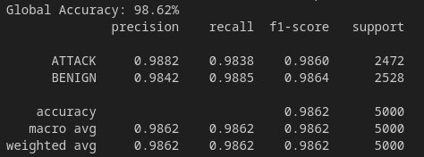
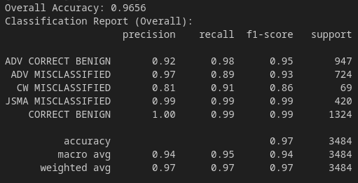
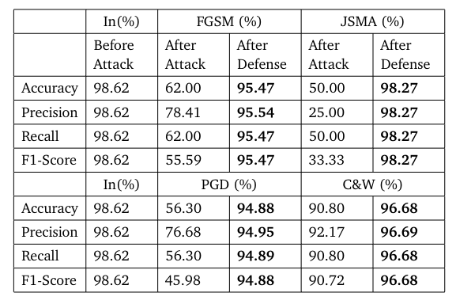

# Prototype: ny

| Properties      | Data    |
|---------------|-----------|
| *Dataset* | `NSL-KDD` |
| *Labels* | `ALL` |
| *Normalization* | `Min-Max` |
| *Sample Size* | `50.000`|
| *Adversarial Attack* | `FGSM & C&W & JSMA & PGD` |
| *Explanations* | `SHAP` |
| *Detector* | `Detect Attacks and Misclassified Samples` |

We now want to evaluate our detector setup on a different network traffic dataset, the *NSL-KDD* dataset. We use all labels and combine all attack labels to the class *ATTACK*. We work on `25.000` *BENIGN* samples and `25.000` *ATTACK* samples. The goal of this Prototype is to check whether the classification performance under the same adversarial attacks is comparable with the same process on the *CICIDS2017* dataset as evaluated in [Prototype *my*](Prototype%20-%20my.md).

# NSL-KDD Dataset

| **Label**         | **Count**  | \| | **Label**         | **Count**  |\|| **Label**           | **Count**  |
|---------------|--------|---|---------------|--------|---|------------------|--------|
| normal        | 77054  |\|| nmap          | 1566   |\|| rootkit          | 23     |
| neptune       | 45871  |\|| back          | 1315   |\|| named            | 17     |
| satan         | 4368   |\|| guess_passwd  | 1284   |\|| ps               | 15     |
| ipsweep       | 3740   |\|| mscan         | 996    |\|| sendmail         | 14     |
| smurf         | 3311   |\|| warezmaster   | 964    |\|| xterm            | 13     |
| portsweep     | 3088   |\|| teardrop      | 904    |\|| imap             | 12     |
| apache2       | 737    |\|| warezclient   | 890    |\|| ftp_write        | 11     |
| processtable  | 685    |\|| snmpguess     | 331    |\|| loadmodule       | 11     |
| saint         | 319    |\|| mailbomb      | 293    |\|| ***other***        | **33** |

# Intrusion Detection System

---
# Detector

We use the same classes as in the previous [Prototype *my*](Prototype%20-%20my.md):

| **Class**               | **Samples** | **Explanations**                          |
|-------------------------|-------------|-------------------------------------------|
| 'ADV CORRECT BENIGN'    | `8.931`    | `Correct BENIGN       - FGSM & PGD      ` |
| 'ADV MISCLASSIFIED'     | `7.429`    | `Misclassified BENIGN - FGSM & PGD      ` |
| 'CW MISCLASSIFIED'      | `762`     | `Misclassified BENIGN - CW              ` |
| 'JSMA MISCLASSIFIED'    | `4.452`     | `Misclassified BENIGN - JSMA            ` |
| 'CORRECT BENIGN'        | `13.263`    | `Correct BENIGN       - Normal & CS & JSMA` |

We can observe that we train with a relative low number of *Misclassified BENIGN - CW* samples. That is why the *C&W* attack is not very powerful on this dataset. The attack results in an accuracy of `90.73%`, meaning only a decrease of `8%` in accuracy was issued by the attack. For the other attacks, the performance was very similar as for the *CICIDS2017* dataset.

Due to the different attack accuracies and database structure, we receive a slightly different detector result:

---
# Evaluation

## Classification

As we can see these result is comparable with our result from [Prototype *my*](Prototype%20-%20kappa.md), the performance is even a little higher.

**This indicates that our created model is suited not only for a single dataset and can also be successfully applied to a complete other dataset!**