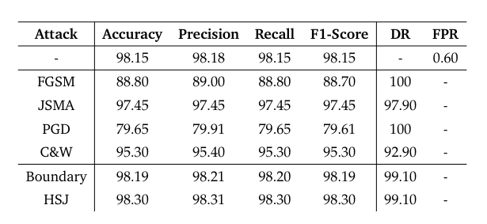

# Prototype: omikron

| Properties      | Data    |
|---------------|-----------|
| *Dateset* | `CICIDS2017` |
| *Labels* | `ALL` |
| *Normalization* | `Min-Max` |
| *Sample Size* | `100.000`|
| *Adversarial Attack* | `FGSM & C&W & JSMA & PGD & Boundary & HSJ` |
| *Explanations* | `SHAP` |
| *Detector* | `Detect Attacks and Misclassified Samples` |

In this Prototype we want to include new Black-Box attacks in form of the Boundary and the Hop-Skip-Jump Attack. We adjust the detector to be trained on all the 4 White-Box attacks and the new 2 Black-Box attacks. We use `50.000` *BENIGN* and `50.000` *ATTACK* samples. We split them evenly between our attacks so that we generate `12.858` adversarial samples for each attack.

---
# Detector

Because we perform a target attack in which *ATTACK* samples are modified so that they are misclassified as *BENIGN* and the two Black-Box Attacks do not change any samples that are *BENIGN* in the first place, we include the unchanged *BENIGN* samples to the detector class *CORRECT BENIGN*. This was also done for the attacks *JSMA* and *C&W*. For the attacks *FGSM* and *PGD* an own detector class for untarget *BENIGN* samples are used because these attacks are modifying these samples even though they are not targeted. As the third class we have a *ADV MISCLASSIFIED* that holds all misclassified as *BENIGN* through an adversarial attack samples.

| **Class**               | **Explanations**                          |
|-------------------------|-------------------------------------------|
| 'ADV CORRECT BENIGN'    | `Untarged BENIGN      - FGSM & PGD      ` |
| 'ADV MISCLASSIFIED'     | `Misclassified BENIGN - FGSM & PGD & CW & JSMA & Boundary & HSJ      ` |
| 'CORRECT BENIGN'        | `Unchanged BENIGN       - Normal & CW & JSMA & Boundary & HSJ` |

---
# Evaluation

## Classification

