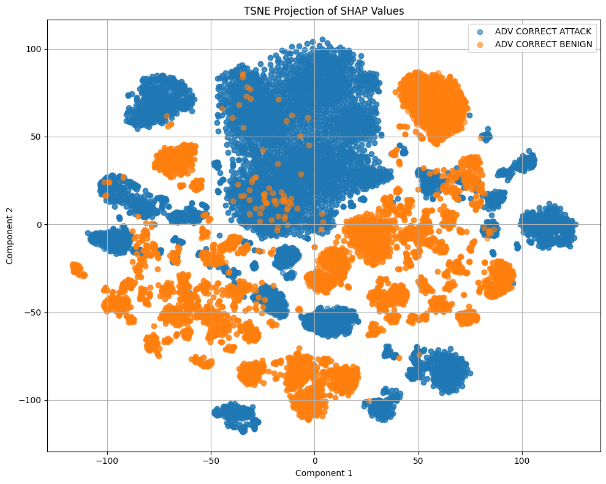

# Prototype: pi

| Properties      | Data    |
|---------------|-----------|
| *Dataset* | `CICIDS2017`|
| *Labels* | `ALL` |
| *Normalization* | `Min-Max` |
| *Sample Size* | `50.000`|
| *Adversarial Attack* | `FGSM & C&W & JSMA & PGD` |
| *Attack Type* | `Untargeted` |
| *Explanations* | `SHAP` |
| *Detector* | `Robust Classification` |

In this Prototype, we evaluate the detectors capability to robustly classify network traffic into *benign* and *malicious*, even under adversarial conditions. For this, we perform several White-Box Attacks (FGSM, PGD, C&W and JSMA) and evaluate if the detector can detect the original label after adversarial perturbation. The evaluation is performed on the CICIDS2017 dataset, using `25.000` samples from each class.

---
# Detector

The task is to robust classify network traffic, so the detector has only two classes: *ADV CORRECT ATTACK* which stands for *malicious* samples, and *ADV CORRECT BENIGN*, which stands for the *benign* samples. In each class, explanations are included that belongs to samples to the correct original label. So for the *ADV CORRECT BENIGN* class, correctly benign and misclassified as malicious explanations are included, while for the *ADV CORRECT ATTACK* class, correctly malicious and misclassified as benign explanations are included. So the detector dataset looks like this:

| **Class**               | **Explanations**                          |
|-------------------------|-------------------------------------------|
| 'ADV CORRECT BENIGN'    | `Correctly Benign & Misclassified as Malicious` |
| 'ADV CORRECT ATTACK'    | `Correctly Malicious & Misclassified as Benign` |

---
# Evaluation

We evaluate the detector on a unseen test set. The following table shows the classification report of the detector. From the results, we can see that the detector is capable of performing robust classification.

We also use the TSNE dimensionality reduction method to show how the SHAP values of both classes behave. From this image we can see clear separation of *benign* and *malicious* explanations, indicating the strong difference of explanations from the contrary labels.

So given this Prototype, we can state, that robust classification based on explanations works very well for our four tested White-Box Attacks.
